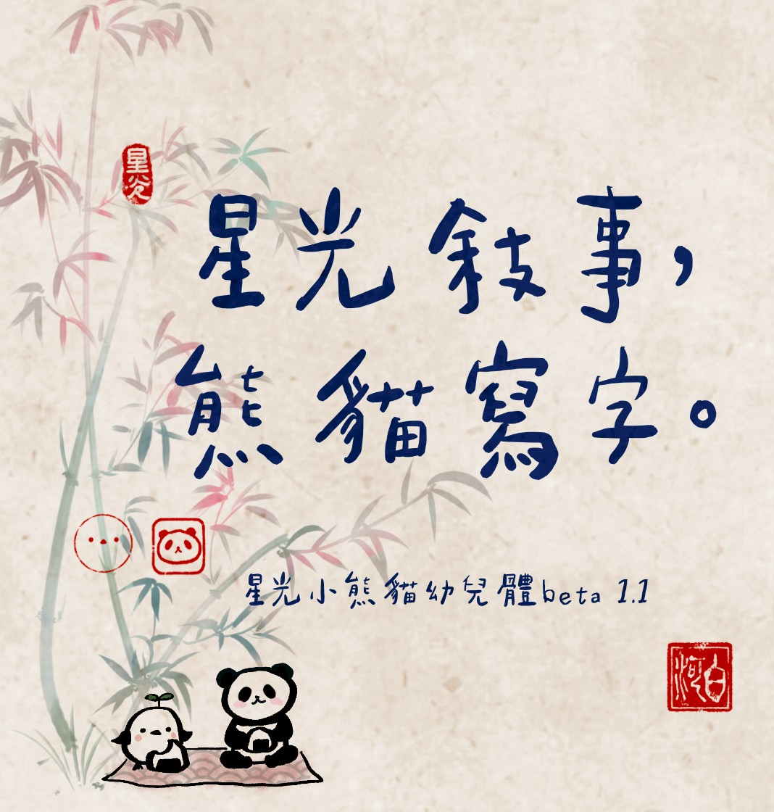

# ⭐️ 星光小熊貓幼兒體－星光敘事，熊貓寫字。

{:target="_blank"}

👉 「星光小熊貓幼兒體」是白河透過 zi-hi.com 自製的第一個手寫字型。

初始風格設定是比較可愛又有點顫抖的小學生體筆觸，但是寫著寫著手越來越痠就越來越……隨緣佛系。

目前已經完成5500+，剩下的字會慢慢在手不痠之後陸續寫完釋出。

目前測試：用來寫甄嬛傳台詞、周星馳台詞、甚至部份佛經，以及工作的腳本稿件都沒有缺字，可供日常使用。

## 📥 下載之前

本字型為免費可商用字型，目前為 beta 1.1 版本，後續的更新情報會透過我的 Instagram 和 Facebook 粉專發佈，還請來到此地的旅人可以先順手按讚追蹤起來！

後續計畫：追蹤人數達到我心中的各個小里程碑之後會釋出追加字型的更新、以及等寬字型等不同版本 💫

- 👉 追蹤我的寫字帳 [白河蝦記Cyber Ink Flow](https://www.instagram.com/cyberinkflow/){:target="_blank"}
- 👉 追蹤我的故事帳 [道友，修仙嗎？](https://www.facebook.com/KinkyPsychics/){:target="_blank"}

  
### Bonus：
- 隨喜斗內白河去做個肩頸按摩，加速寫字進度


## 🔗 下載連結

👉 請依需求下載對應版本：

- GitHub Release  
  ```markdown
  [下載 v👉 請輸入版本號](https://github.com/👉你的帳號/👉你的repo/releases/download/v👉版本號/👉檔名.zip)


## 📜 授權方式

### 一、授權範圍：

本字型檔案可供個人及商業專案免費使用。可以在任何設計軟體、簡報、海報、社群媒體貼文、個人網站等處自由使用本字型，無須事先告知或取得授權。

### 二、禁止事項：

- 禁止二次改作： 禁止將本字型檔案進行任何形式的修改、拆解或二次創作。

- 禁止販售： 禁止單獨或以任何形式（例如：作為設計素材包的一部分）販售本字型檔案。

- 禁止未經授權散布： 禁止未經創作者同意，擅自將本字型檔案上傳至任何網站、平台或雲端空間供他人下載。請務必導引下載者回到原發布連結。

### 三、著作權聲明：

本字型檔案的著作權，包含但不限於其所有筆畫、結構與設計，皆完全歸屬於創作者白河所有。

### 四、免責聲明：

創作者不對因使用本字型所產生的任何直接或間接損害承擔責任。

本版權聲明旨在保護創作者的智慧財產權，同時確保使用者能合法且自由地享受字型所帶來的樂趣。若有任何疑問，歡迎隨時與我聯繫。 kinkypsychics@gmail.com


## 🖼️ 應用範例

以下是字型應用的部分展示：


## 📝 更新紀錄

👉 2025.09 - 星光小熊貓幼兒體 Beta 1.1 釋出


## 📖 製作故事

👉 請輸入：這個專案／字型是怎麼誕生的？靈感來源是什麼？設計過程中有什麼趣事？
